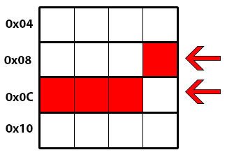
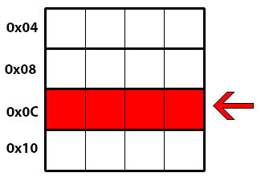

<!--
https://www.gamedev.net/articles/programming/general-and-gameplay-programming/c-custom-memory-allocation-r3010/
-->

# C++: Custom memory allocation

**By Tiago Costa, April 15, 2013, [Posted By Aqua Costa](https://www.gamedev.net/profile/147695-tiagocosta/)**

Fast memory allocations along with memory leak detection can have a big impact on games performance. C++ provides two well known functions to allocate dynamic (heap) memory (*malloc* and *new*), these functions are usually very slow because they're general purpose functions and in some implementations require a context-switch from user mode into kernel mode. These functions also do not provide any kind of memory leak detection system natively. Using custom allocators we can have well defined usage patterns and optimize the allocation process accordingly.

Source code is available in the Aqua Engine at https://github.com/tiagovcosta/aquaengine (under Core/Allocators).

## Base Allocator

Every allocator in this articles series will be derived from the class Allocator that declares 2 virtual functions (*allocate* and *deallocate*) that must be defined by each allocator.

**Allocator.h**

```
class Allocator {
public:
    Allocator(size_t size, void *start) {
        _start = start;
        _size = size;
        _used_memory = 0;
        _num_allocations = 0;
    }

    virtual ~Allocator() {
        ASSERT(_num_allocations == 0 && _used_memory == 0);
        _start = nullptr;
        _size = 0;
    }

    virtual void *allocate(size_t size, u8 alignment = 4) = 0;
    virtual void deallocate(void *p) = 0;
    void *getStart() const {
        return _start;
    }
    size_t getSize() const {
        return _size;
    }
    size_t getUsedMemory() const {
        return _used_memory;
    }
    size_t getNumAllocations() const {
        return _num_allocations;
    }

protected:
    void *_start;
    size_t _size;
    size_t _used_memory;
    size_t _num_allocations;
};

namespace allocator {
template <class T>
T *allocateNew(Allocator &allocator) {
    return new (allocator.allocate(sizeof(T), __alignof(T))) T;
}

template <class T>
T *allocateNew(Allocator &allocator, const T &t) {
    return new (allocator.allocate(sizeof(T), __alignof(T))) T(t);
}

template <class T>
void deallocateDelete(Allocator &allocator, T &object) {
    object.~T();
    allocator.deallocate(&object);
}

template <class T>
T *allocateArray(Allocator &allocator, size_t length) {
    ASSERT(length != 0);
    u8 headerSize = sizeof(size_t) / sizeof(T);

    if (sizeof(size_t) % sizeof(T) > 0)
        headerSize += 1;

    // Allocate extra space to store array length in the bytes before the array
    T *p = (T *)allocator.allocate(sizeof(T) * (length + headerSize),
                                   __alignof(T));
    p += headerSize;

    *(((size_t *)p) - 1) = length;

    for (size_t i = 0; i < length; i++)
        new (&p) T;

    return p;
}

template <class T>
void deallocateArray(Allocator &allocator, T *array) {
    ASSERT(array != nullptr);
    size_t length = *(((size_t *)array) - 1);

    for (size_t i = 0; i < length; i++)
        array.~T();

    // Calculate how much extra memory was allocated
    // to store the length before the array
    u8 headerSize = sizeof(size_t) / sizeof(T);
    if (sizeof(size_t) % sizeof(T) > 0)
        headerSize += 1;

    allocator.deallocate(array - headerSize);
}
}; // namespace allocator
```

### Memory leak detection

In the code above you can see an assert in the destructor, this is a simple and easy way to check if you forgot to deallocate any memory, that won't cause any overhead or take any extra memory. This simple method won't tell which allocation you forgot to deallocate but it will pin point in which allocator the leak occured so you can find the leak faster (especially if you use Proxy Allocators like I suggest later in this article).

## Aligned Allocations

Processors access memory in word-sized blocks, so when a processor tries to access memory in an unaligned address it might have to access more word-sized memory blocks than would be needed if the memory was aligned and perform masking/shifting to get the required data in the register. Example: A processor accesses memory in 4-byte words (it can only directly access the words starting at (0x00, 0x04, 0x08, 0x0C,...). If it needs to access data (4 bytes) stored at the address 0x0B it will have to read two word-sized blocks (the address 0x08 and the address 0x0C) because the data crosses the boundary from one of the blocks to the other:



If the data was stored in an aligned address like 0x0C the processor could read it in a single memory access:



### Aligned data definition

Primitive data is said to be aligned if the memory address where it is stored is a multiple of the size of the primitive. A data aggregate is said to be aligned if each primitive element in the aggregate is aligned.

### Implementation

To **n**-byte align a memory address **x** we need to mask off the log2(**n**) least significant bits from **x**. Simply masking off bits will return the first **n**-byte aligned address before **x**, so in order to find the first after **x** we just need to add *alignment-1* to **x** and mask that address.

```
inline void *alignForward(void *address, u8 alignment) {
    return (void *)((reinterpret_cast<u8 *>(address) +
                     static_cast<u8>(alignment - 1)) &
                    static_cast<u8>(~(alignment - 1)));
}
```

It can be useful to calculate by how many bytes the address needs to adjusted to be aligned.

```
inline u8 alignForwardAdjustment(const void *address, u8 alignment) {
    u8 adjustment = alignment - (reinterpret_cast<u8 *>(address) &
                                 static_cast<u8 *>(alignment - 1));
    if (adjustment == alignment)
        return 0;

    // Already aligned
    return adjustment;
}
```

Some allocators need to store an header before each allocation so they can use the adjustment space to reduce the memory overhead caused by the headers.

```
inline u8 alignForwardAdjustmentWithHeader(const void *address, u8 alignment,
                                           u8 headerSize) {
    u8 adjustment = alignForwardAdjustment(address, alignment);
    u8 neededSpace = headerSize;

    if (adjustment < neededSpace) {
        neededSpace -= adjustment;

        // Increase adjustment to fit header
        adjustment += alignment * (neededSpace / alignment);

        if (neededSpace % alignment > 0)
            adjustment += alignment;
    }

    return adjustment;
}
```

The alignment must be a power of 2!

## Linear Allocator

A Linear Allocator is the simplest and fastest type of allocator. Pointers to the start of the allocator, to the first free address and the total size of the allocator are maintained.

### Allocations

New allocations simply move the pointer to the first free address forward.

### Deallocations

Individual deallocations cannot be made in linear allocators, instead use clear() to completely clear the memory used by the allocator.

### Implementation

**LinearAllocator.h**

```
#include "Allocator.h"

class LinearAllocator : public Allocator {
public:
    LinearAllocator(size_t size, void *start);
    ~LinearAllocator();

    void *allocate(size_t size, u8 alignment) override;
    void deallocate(void *p) override;
    void clear();

private:
    LinearAllocator(const LinearAllocator &);

    // Prevent copies because it might cause errors
    LinearAllocator &operator=(const LinearAllocator &);
    void *_current_pos;
};
```

**LinearAllocator.cpp**

```
#include "LinearAllocator.h"

LinearAllocator::LinearAllocator(size_t size, void *start)
    : Allocator(size, start), _current_pos(start) {
    ASSERT(size > 0);
}

LinearAllocator::~LinearAllocator() {
    _current_pos = nullptr;
}

void *LinearAllocator::allocate(size_t size, u8 alignment) {
    ASSERT(size != 0);
    u8 adjustment =
        pointer_math::alignForwardAdjustment(_current_pos, alignment);

    if (_used_memory + adjustment + size > _size)
        return nullptr;

    uptr aligned_address = (uptr)_current_pos + adjustment;
    _current_pos = (void *)(aligned_address + size);
    _used_memory += size + adjustment;
    _num_allocations++;

    return (void *)aligned_address;
}

void LinearAllocator::deallocate(void *p) {
    ASSERT(false && "Use clear() instead");
}

void LinearAllocator::clear() {
    _num_allocations = 0;
    _used_memory = 0;
    _current_pos = _start;
}
```

## Stack Allocator

A Stack Allocator, like the name says, works like a stack. Along with the stack size, three pointers are maintained:

- Pointer to the start of the stack.
- Pointer to the top of the stack.
- Pointer to the last allocation made. (This is optional in release builds)

### Allocations

New allocations move the pointer up by the requested number of bytes plus the adjustment needed to align the address and store the *allocation header*. The *allocation header* provides the following information:

- Adjustment used in this allocation
- Pointer to the previous allocation

### Deallocations

Memory must be deallocated in inverse order it was allocated! So if you allocate object A and then object B you must free object B memory before you can free object A memory.

To deallocate memory the allocator checks if the address to the memory that you want to deallocate corresponds to the address of the last allocation made. If so the allocator accesses the *allocation header* so it also frees the memory used to align the allocation and store the allocation header, and it replaces the pointer to the last allocation made with the one in the *allocation header*.

### Implementation

**StackAllocator.h**

```
#include "Allocator.h"

class StackAllocator : public Allocator {
public:
    StackAllocator(size_t size, void *start);
    ~StackAllocator();

    void *allocate(size_t size, u8 alignment) override;
    void deallocate(void *p) override;

private:
    StackAllocator(const StackAllocator &);

    // Prevent copies because it might cause errors
    StackAllocator &operator=(const StackAllocator &);

    struct AllocationHeader {
#if _DEBUG
        void *prev_address;
#endif

        u8 adjustment;
    };

#if _DEBUG
    void *_prev_position;
#endif

    void *_current_pos;
};
```

**StackAllocator.cpp**

```
#include "StackAllocator.h"

StackAllocator::StackAllocator(size_t size, void *start)
    : Allocator(size, start), _current_pos(start) {
    ASSERT(size > 0);
#if _DEBUG
    _prev_position = nullptr;
#endif
}

StackAllocator::~StackAllocator() {
#if _DEBUG
    _prev_position = nullptr;
#endif

    _current_pos = nullptr;
}

void *StackAllocator::allocate(size_t size, u8 alignment) {
    ASSERT(size != 0);
    u8 adjustment = pointer_math::alignForwardAdjustmentWithHeader(
        _current_pos, alignment, sizeof(AllocationHeader));

    if (_used_memory + adjustment + size > _size)
        return nullptr;

    void *aligned_address = pointer_math::add(_current_pos, adjustment);

    // Add Allocation Header
    AllocationHeader *header = (AllocationHeader *)(pointer_math::subtract(
        aligned_address, sizeof(AllocationHeader)));
    header->adjustment = adjustment;

#if _DEBUG
    header->prev_address = _prev_position;
    _prev_position = aligned_address;
#endif

    _current_pos = pointer_math::add(aligned_address, size);
    _used_memory += size + adjustment;
    _num_allocations++;

    return aligned_address;
}

void StackAllocator::deallocate(void *p) {
    ASSERT(p == _prev_position);

    // Access the AllocationHeader in the bytes before p
    AllocationHeader *header = (AllocationHeader *)(pointer_math::subtract(
        p, sizeof(AllocationHeader)));
    _used_memory -= (uptr)_current_pos - (uptr)p + header->adjustment;
    _current_pos = pointer_math::subtract(p, header->adjustment);

#if _DEBUG
    _prev_position = header->prev_address;
#endif

    _num_allocations--;
}
```

Storing the last previous allocations in a list-like fashion and checking it before deallocations is not mandatory so it can be disabled in release builds. It's just helpful to prevent memory from being overwritten causing bugs.

## FreeList Allocator

The FreeList allocator allows allocations of any size to be made (inside the available memory) and deallocations in any order. A linked-list of free blocks of memory is maintained (each free block contains information about its size and a pointer to the next free block).

### Allocations

The allocator tries to find a free block large enough for the allocation to fit, if it finds multiple free blocks that meet the requeriments, there's 3 simple ways to decide which free block to choose:

- First-fit - Use the first.
- Best-fit - Use the smallest.
- Worst-fit - Use the largest.

The best-fit method will in most cases cause less fragmentation than the other 2 methods.

In the example implementation below I use the first-fit method.

### Deallocation

The allocator keeps the free blocks orderer by the start position. When an allocation is freed the allocator finds the right position in the free blocks list and tries to merge it with the adjacent blocks.

### Implementation

**FreeListAllocator.h**

```
#include "Allocator.h"

class FreeListAllocator : public Allocator {
public:
    FreeListAllocator(size_t size, void *start);
    ~FreeListAllocator();

    void *allocate(size_t size, u8 alignment) override;
    void deallocate(void *p) override;

private:
    struct AllocationHeader {
        size_t size;
        u8 adjustment;
    };
    struct FreeBlock {
        size_t size;
        FreeBlock *next;
    };
    FreeListAllocator(const FreeListAllocator &);

    // Prevent copies because it might cause errors
    FreeListAllocator &operator=(const FreeListAllocator &);
    FreeBlock *_free_blocks;
};
```

**FreeListAllocator.cpp**
```
#include "FreeListAllocator.h"

FreeListAllocator::FreeListAllocator(size_t size, void *start)
    : Allocator(size, start), _free_blocks((FreeBlock *)start) {
    ASSERT(size > sizeof(FreeBlock));
    _free_blocks->size = size;
    _free_blocks->next = nullptr;
}

FreeListAllocator::~FreeListAllocator() {
    _free_blocks = nullptr;
}

void *FreeListAllocator::allocate(size_t size, u8 alignment) {
    ASSERT(size != 0 && alignment != 0);
    FreeBlock *prev_free_block = nullptr;
    FreeBlock *free_block = _free_blocks;

    while (free_block != nullptr) {
        // Calculate adjustment needed to keep object correctly aligned
        u8 adjustment = pointer_math::alignForwardAdjustmentWithHeader(
            free_block, alignment, sizeof(AllocationHeader));
        size_t total_size = size + adjustment;

        // If allocation doesn't fit in this FreeBlock, try the next
        if (free_block->size < total_size) {
            prev_free_block = free_block;
            free_block = free_block->next;
            continue;
        }

        static_assert(sizeof(AllocationHeader) >= sizeof(FreeBlock),
                      "sizeof(AllocationHeader) < sizeof(FreeBlock)");

        // If allocations in the remaining memory will be impossible
        if (free_block->size - total_size <= sizeof(AllocationHeader)) {
            // Increase allocation size instead of creating a new FreeBlock
            total_size = free_block->size;

            if (prev_free_block != nullptr)
                prev_free_block->next = free_block->next;
            else
                _free_blocks = free_block->next;
        } else {
            // Else create a new FreeBlock containing remaining memory
            FreeBlock *next_block =
                (FreeBlock *)(pointer_math::add(free_block, total_size));

            next_block->size = free_block->size - total_size;
            next_block->next = free_block->next;

            if (prev_free_block != nullptr)
                prev_free_block->next = next_block;
            else
                _free_blocks = next_block;
        }

        uptr aligned_address = (uptr)free_block + adjustment;
        AllocationHeader *header =
            (AllocationHeader *)(aligned_address - sizeof(AllocationHeader));
        header->size = total_size;
        header->adjustment = adjustment;
        _used_memory += total_size;
        _num_allocations++;

        ASSERT(pointer_math::alignForwardAdjustment((void *)aligned_address,
                                                    alignment) == 0);

        return (void *)aligned_address;
    }

    // ASSERT(false && "Couldn't find free block large enough!");
    return nullptr;
}

void FreeListAllocator::deallocate(void *p) {
    ASSERT(p != nullptr);
    AllocationHeader *header =
        (AllocationHeader *)pointer_math::subtract(p, sizeof(AllocationHeader));
    uptr block_start = reinterpret_cast<uptr>(p) - header->adjustment;
    size_t block_size = header->size;
    uptr block_end = block_start + block_size;
    FreeBlock *prev_free_block = nullptr;
    FreeBlock *free_block = _free_blocks;

    while (free_block != nullptr) {
        if ((uptr)free_block >= block_end)
            break;
        prev_free_block = free_block;
        free_block = free_block->next;
    }

    if (prev_free_block == nullptr) {
        prev_free_block = (FreeBlock *)block_start;
        prev_free_block->size = block_size;
        prev_free_block->next = _free_blocks;
        _free_blocks = prev_free_block;
    } else if ((uptr)prev_free_block + prev_free_block->size == block_start) {
        prev_free_block->size += block_size;
    } else {
        FreeBlock *temp = (FreeBlock *)block_start;
        temp->size = block_size;
        temp->next = prev_free_block->next;
        prev_free_block->next = temp;
        prev_free_block = temp;
    }

    if (free_block != nullptr && (uptr)free_block == block_end) {
        prev_free_block->size += free_block->size;
        prev_free_block->next = free_block->next;
    }

    _num_allocations--;
    _used_memory -= block_size;
}
```

## Pool Allocator

This allocator only allows allocations of a fixed size and alignment to be made, this results in both fast allocations and deallocations to be made. Like the FreeList allocator, a linked-list of free blocks is maintaied but since all blocks are the same size each free block only needs to store a pointer to the next one. Another advantage of Pool allactors is no need to align each allocation, since all allocations have the same size/alignment only the first block has to be aligned, this results in a almost non-existant memory overhead.

The block size of the Pool Allocator must be larger than *sizeof(void\*)* because when blocks are free they store a pointer to the next free block in the list.

### Allocations

The allocator simply returns the first free block and updates the linked list.

### Deallocations

The allocator simply adds the deallocated block to the free blocks linked list.

### Implementation

**PoolAllocator.h**

```
#include "Allocator.h"

class PoolAllocator : public Allocator {
public:
    PoolAllocator(size_t objectSize, u8 objectAlignment, size_t size,
                  void *mem);
    ~PoolAllocator();
    void *allocate(size_t size, u8 alignment) override;
    void deallocate(void *p) override;

private:
    PoolAllocator(const PoolAllocator &);

    // Prevent copies because it might cause errors
    PoolAllocator &operator=(const PoolAllocator &);
    size_t _objectSize;

    u8 _objectAlignment;
    void **_free_list;
};
```

**PoolAllocator.cpp**

```
#include "PoolAllocator.h"

PoolAllocator::PoolAllocator(size_t objectSize, u8 objectAlignment, size_t size,
                             void *mem)
    : Allocator(size, mem), _objectSize(objectSize),
      _objectAlignment(objectAlignment) {
    ASSERT(objectSize >= sizeof(void *));

    // Calculate adjustment needed to keep object correctly aligned
    u8 adjustment = pointer_math::alignForwardAdjustment(mem, objectAlignment);
    _free_list = (void **)pointer_math::add(mem, adjustment);
    size_t numObjects = (size - adjustment) / objectSize;
    void **p = _free_list;

    // Initialize free blocks list
    for (size_t i = 0; i < numObjects - 1; i++) {
        *p = pointer_math::add(p, objectSize);
        p = (void **)*p;
    }

    *p = nullptr;
}

PoolAllocator::~PoolAllocator() {
    _free_list = nullptr;
}

void *PoolAllocator::allocate(size_t size, u8 alignment) {
    ASSERT(size == _objectSize && alignment == _objectAlignment);
    if (_free_list == nullptr)
        return nullptr;
    void *p = _free_list;
    _free_list = (void **)(*_free_list);
    _used_memory += size;
    _num_allocations++;
    return p;
}

void PoolAllocator::deallocate(void *p) {
    *((void **)p) = _free_list;
    _free_list = (void **)p;
    _used_memory -= _objectSize;
    _num_allocations--;
}
```

## Proxy Allocator

A Proxy Allocator is a special kind of allocator. It is just used to help with memory leak and subsystem memory usage tracking. It will simply redirect all allocations/deallocations to the allocator passed as argument in the constructor while keeping track of how many allocations it made and how much memory it is "using". Example: Two subsystems use the same allocator A. If you want to show in the debugging user interface how much memory each subsystem is using, you create a proxy allocator, that redirects all allocations/deallocations to A, in each subsystem and track their memory usage. It will also help in memory leak tracking because the assert in the proxy allocator destructor of the subsystem that is leaking memory will fail.

### Implementation

**ProxyAllocator.h**

```
#include "Allocator.h"

class ProxyAllocator : public Allocator {
public:
    ProxyAllocator(Allocator &allocator);
    ~ProxyAllocator();
    void *allocate(size_t size, u8 alignment) override;
    void deallocate(void *p) override;

private:
    ProxyAllocator(const ProxyAllocator &);

    // Prevent copies because it might cause errors
    ProxyAllocator &operator=(const ProxyAllocator &);
    Allocator &_allocator;
};
```

**ProxyAllocator.cpp**
```
#include "ProxyAllocator.h"

ProxyAllocator::ProxyAllocator(Allocator &allocator)
    : Allocator(allocator.getSize(), allocator.getStart()),
      _allocator(allocator) {
}

ProxyAllocator::~ProxyAllocator() {
}

void *ProxyAllocator::allocate(size_t size, u8 alignment) {
    ASSERT(size != 0);
    _num_allocations++;
    size_t mem = _allocator.getUsedMemory();

    void *p = _allocator.allocate(size, alignment);
    _used_memory += _allocator.getUsedMemory() - mem;
    return p;
}

void ProxyAllocator::deallocate(void *p) {
    _num_allocations--;
    size_t mem = _allocator.getUsedMemory();
    _allocator.deallocate(p);
    _used_memory -= mem - _allocator.getUsedMemory();
}
```

## Allocator Managment

A large block of memory should be allocated when the program starts using *malloc* (and this should be the only malloc made) this large block of memory is managed by a global allocator (for example a stack allocator). Each subsystem should then allocate the block of memory it needs to work from the global allocator, and create allocators that will manage that memory.

### Example usage

- Allocate 1GB of memory using malloc and create a FreeList allocator to manage that memory.
- Create a Proxy allocator that redirects all allocations to the FreeList allocator.
- Initialize the Resource Manager by passing a pointer to the Proxy allocator in the constructor.
- Register the Proxy allocator in the memory usage tracker so it shows how much memory the Resource Manager is using.
- Allocate 16MB of memory using the FreeList allocator and create a Linear allocator to manage that memory and register it in the memory usage tracker.
- Use the Linear allocator to make small temporary allocations needed for game logic, etc, and clear it before the end of each frame.
- The Resource Manager will create a Pool allocator for every ResourcePackage it loads.

## Tips & Tricks

- Depending on the type of allocator, keep the number of individual allocations to a minimum to reduce the memory wasted by allocation headers.
- Prefer using *allocateArray()* to individual allocations when it makes sense. Most allocators will use extra memory in each allocation to store *allocation headers* and arrays will only need single header.
- Instead of making small size allocations from allocators with large amounts of memory available, allocate a single memory block capable of holding all the small allocations and create a new allocator to manage the memory block and make the small allocations from this block.

## Performance Comparison

To test the performance of each allocator compared to *malloc* I wrote a program that measures how long it takes to make 20000 allocations (you can download the program in the end of the article), the tests where made in release mode and the results are averages of 3 runs.

### Malloc vs Linear Allocator

10k 16 bytes allocations + 1k 256 bytes allocations + 50 2Mb allocations/deallocations (allocations made using the linear allocator are deallocated in a single call to clear().

```
Allocator       Time (s)
Malloc          0.639655
Linear          0.000072
```

### Malloc vs Stack Allocator

10k 16 bytes allocations + 1k 256 bytes allocations + 50 2Mb allocations/deallocations

```
Allocator       Time (s)
Malloc          0.650435
Stack           0.000289
```

### Malloc vs FreeList Allocator

10k 16 bytes allocations + 1k 256 bytes allocations + 50 2Mb allocations/deallocations

```
Allocator       Time (s)
Malloc          0.673865
FreeList        0.000414
```

### Malloc vs Pool Allocator

20k 16 bytes allocations/deallocations

```
Allocator       Time (s)
Malloc          1.454934
Pool            0.000193
```

## Conclusion

There isn't a single best allocator - it's important to think about how the memory will be allocated/accessed/deallocated and choose the right allocator for each situation. **Full source code and performance tests in the attached file**

## Reference

- [Game Engine Architecture, Jason Gregory 2009](http://www.gameenginebook.com/)
- http://bitsquid.blogspot.pt/2010/09/custom-memory-allocation-in-c.html
- http://molecularmusings.wordpress.com/2011/07/05/memory-system-part-1/

## Article Update Log

**04 March 2014:** Rewritten *FreeListAllocator*, added support to x64. (Also updated code style and added a new test).

**16 November 2013**: Fixed two errors in *FreeListAllocator.cpp* lines 48 and 60

**14 April 2013**: Fixed an error in *allocateArray*

**13 April 2013**: FreeList and Pool allocators added

**12 April 2013**: Performance comparison & test project added

**11 April 2013**: Initial release
