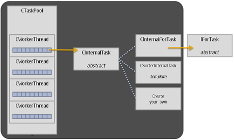
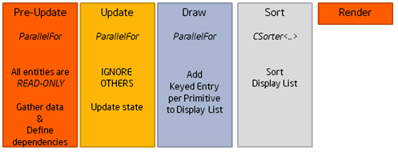
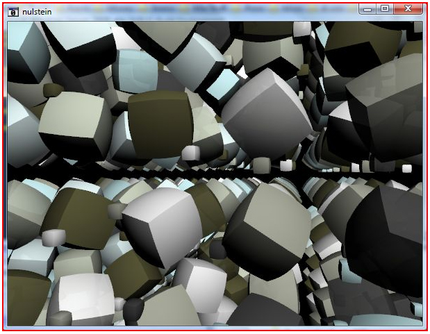
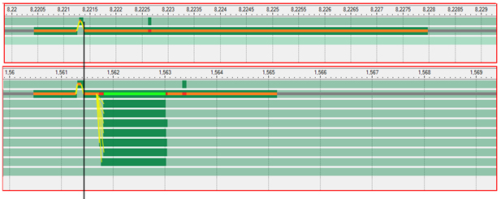
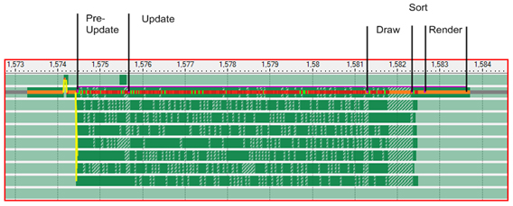

<!--
https://software.intel.com/en-us/articles/do-it-yourself-game-task-scheduling
-->

<!--
Each line must not exceed 80 characters.
-->

# Do-it-yourself Game Task Scheduling

**By jerome-muffat-meridol, published on November 3, 2009**

I attended my first demo party in 2008: Evoke in Germany. I was giving a talk
about multi-core optimization in games and how to use Intel® Threading Building
Blocks (Intel® TBB) to efficiently spread work over threads, when this question
came up: Can I use this in 64K? The rules for 64K demos are simple, "65536 bytes
maximum, one self contained executable," and the results are often unbelievable.
Intel® TBB happens to be a really elegant and slim library but, at 200KB, it
just won't do. But, I hate to say no. Inevitably, I couldn't help but
contemplate the idea of a sort of working scale model of *Intel® Threading*
*Building Blocks*. It would be a minimal task scheduler, something that would be
easy to study, tear apart, and play with. I was on a mission!

Nulstein is the demo I created to address this need. It shows a simple but
effective method for implementing task scheduling that can be adapted to most
game platforms. [Click this link to download the code to Nulstein][1].

[1]: https://software.intel.com/sites/default/files/m/d/4/1/d/8/nulstein.zip

## Scheduling Tasks

If you are not familiar with task schedulers and why they are useful in games,
the key lies in the difference between a thread and a task. A thread is a
virtually infinite stream of operations which blocks when it needs to
synchronize with another thread. A task, on the other hand, is a short stream
of operations that executes a fraction of the work independently of other tasks
and doesn't block. These properties make it possible to execute as many tasks
simultaneously as the processor can run physical threads, and the work of the
task scheduler mainly comes down to finding a new task to start when one
finishes. This becomes truly powerful when you add that a task can itself spawn
new tasks, as part of its execution or as a continuation. If the idea of
splitting work in a collection of smaller tasks is straightforward, dealing with
situations where a thread would normally block can be trickier. Most of the time
a task can simply consume other tasks until the expected condition arises, and
otherwise it is usually a simple matter of splitting the work in two tasks
around the waiting point and letting the synchronization happen implicitly. But
we'll come back to this later on.

Breaking work down into tasks and using a scheduler with task stealing is a
convenient, powerful, and efficient way to make use of multi-core processors.

From a programming standpoint, on a system with `n` logical cores, Nulstein
creates `n-1` worker threads to assist the game's main thread with running the
tasks. Each worker manages its own "pile of work," a list of tasks that are
ready to run. Every time one task finishes the worker picks the next one from
the top of its pile; similarly, when a task is created it is dropped directly on
to the top of the pile. This is much more efficient than having one global job
queue, as each thread can work independently without any contention. But there
is a catch: some piles might become empty much faster than others. In these
cases, the scheduler steals the bottom half of the pile of a busy thread and
gives it to a starving thread. This turns out to limit contention considerably
because only two threads are impacted by the mutual exclusion necessary to carry
out this operation.

## Tasks and Task Pool Overview



**Figure 1**

The task engine code is in `TaskScheduler.h/.inl/.cpp` (header, inlines, and
code). `CTaskPool` is primarily a collection of `CWorkerThread`, where the bulk
of the logic resides. `CInternalTask` is the abstract superclass for all tasks;
you will use subclasses of this class in the implementation of ParallelFor and
`CSorter`.

ParallelFor is the simplest form of parallel code: a loop where iterations can
execute independently of each other. Given a range and a method to process a
section, work is spread over available threads and ParallelFor returns once it
has covered the full range.

`CSorter` implements a simple parallel merge sort, spawning new tasks for blocks
bigger than a given threshold. Although the goal is to reduce code size, this is
done as a C++ template to avoid the overhead of calling a function every time
two items need to be compared.

There is a very convenient effect here: code using these functions can still be
understood as serial code. Code around a `ParallelFor` executes before and after
it, just as it reads.

For uses beyond simple looping and sorting, you will need to spawn your own
tasks. This is quite simple too:

```
{
    CTaskCompletion Flag;
    CMyTask* pTask;
	
    pTask = new CMyTask(&Flag,…);
    pThread->PushTask(pTask);
    …
    pThread->WorkUntilDone(&Flag);
}
```

Your specific task is implemented by `CMyTask` and you use Flag to track when it
is done. (Note that pThread must be the current thread.) Once PushTask has been
called, the task is eligible to be executed by the scheduler, or may be stolen
by another thread. The current thread can continue to do other things, including
pushing more tasks, until it calls `WorkUntilDone`. This last call will run
tasks from the thread's pile, or attempt to steal from other threads, until the
completion flag is set. Again, it looks as if your task had been executed
serially as part of the call (and it might have, indeed).

```
{
     CMyTask* pTask;
	
     pTask = new CMyTask(pThread->m_pCurrentCompletion,…);
     pThread->PushTask(pTask);
}
```

In this alternative form, the task is created as a continuation, and you don't
wait for it to complete as whatever waits for you will now also wait for this
new task. When possible, this is a better approach as this is less
synchronization work.

These basic blocks are enough to implement all sorts of parallel algorithms
used in games, in a fashion that reads serially. You still have to worry about
access to shared data, but you can continue to write code that works in a series
of steps which remain easy to read.

## Inside the scheduler

Looking at what is happening inside, you see `CTaskPool` is the central object;
it creates and holds the worker threads. Initially, these are blocked waiting on
a semaphore, the scheduler is idle and consumes no CPU. As soon as the first
task is submitted, it is split between all threads (if possible) and the
semaphore is raised by `worker_count` in one step, waking all threads as close
to immediately as possible. The pool keeps track of the completion flag for this
root task and workers keep running until it becomes set. Once done, all threads
go idle again and a separate semaphore is used to make sure all threads are back
to idle before accepting any new task. Conceptually, all workers are always in
the same state: either all idle or all running.

The role of `CWorkerThread` is to handle tasks, which can be broken down into
processing, queuing, and stealing them.

- Processing - The threadproc handles the semaphores mentioned earlier and
  repeatedly calls `DoWork(NULL)` when active. This method pops tasks from the
  pile until there are no more, and then it tries to steal from other workers
  and returns if it can't find anything to steal. `DoWork` also can be called by
  `WorkUntilDone` if a task needs to wait for another to finish before it can
  continue; in this case the expected completion flag is passed as a parameter
  and `DoWork` returns as soon as it finds it set.

- Queuing - Because of stealing, there is a risk of contention. Since operations
  on the queue require a lock, use a spinning mutex, because you need to protect
  only a few instructions. PushTask increments the task's completion flag and
  puts the task at the top of the queue. In the special case when the queue is
  full, run the task immediately as this produces the correct result. It's also
  worth noting that if the queue is full, then other workers must be busy too or
  they'd be stealing from you. Tasks also get executed immediately in the
  special case of a single core system because there is no point in queuing work
  when there is nothing to steal it; the whole scheduler is bypassed and the
  overhead of the library disappears.

- Stealing - StealTasks handles the stealing. It loops on all other workers
  checking if one wants to `GiveUpSomeWork`. If a worker has only one task
  queued, it will attempt to split it in two and transfer a "half-task" to the
  idle thread. If it didn't split or if there is more than one, it will return
  half the tasks (rounding up). The fact that workers are spinning on StealTasks
  when their queue is empty enables them to return to work as soon as a task
  becomes available. This is important in the context of a game where latency
  tends to be more important than throughput.

There isn't much more to the scheduler than that. The rest is implementation
details best left to discover in the source code. But before you do that, you
should know how the Nulstein demo uses the scheduler to take maximum advantage
of implicit synchronization and to achieve most of the frame in parallel.

## A Parallel Game Loop



**Figure 2**

There are traditionally two main phases in a frame: the update that advances
time and the draw that makes an image. In Nulstein, these phases have been
subdivided further to achieve parallelism.

The update is split into two phases. The first is a pre-update phase where every
entity can read from every other but cannot modify its public state. This allows
every entity to make decisions based on the state at "previous frame." They will
then apply changes during the second phase, which is the actual Update. The rule
for this second phase is that an entity can write to its state but must not
access any other entity. This enables both of these phases to run as simple
ParallelFor's and is trivial to implement unless there is a hard dependency
between entities and you can't use the previous frame's state. A classic example
would be a camera attached to a car: you don't want the viewport to move inside
the car and need to know its exact position and orientation before you can
update the camera. In these cases an entity can declare itself dependent on
another entity (or several entities) and be updated only once it has been
updated. And because you know they have finished updating, it's okay for the
dependent object to read the updated states. In the demo, this is how the small
cubes manage to stay tightly attached to the corners of bigger cubes.



**Figure 3**

The draw phase is split into three phases. During the Draw, every entity is
called to list items it needs to render and adds the items to a display list.
The list has a 64 bits key that encodes an ID and other data such as z-order,
alpha-blending, material, and so on. This is done through a ParallelFor, with
each thread adding to independent sections of an array. During this phase,
things like visibility culling and filling of dynamic buffers can be done in
parallel. Once every entity has declared what it wants to draw, the array goes
through Sort which can be done in parallel too (although here, with entities in
the order of a thousand, it doesn't make a difference). Finally, the scene is
rendered, each item in the sorted list calling back the parent entity which
does the actual draw calls.



**Figure 4**

In figure 4, there are two Intel® Thread Profiler captures of a release build
running on a *Intel® Core™ i7 processor* at 3.2GHz, at the same scale, with the
task scheduler on and off. Because this is a release build, there is no
annotation but the benefit of using the task scheduler is nevertheless quite
clear; work is shown as green bars, with the serial case above and the parallel
case below. The phase that remains serial is the render phase and it is mainly
spent in DirectX and the graphics driver, with the gray line representing time
spent waiting for vblank.

Figure 5 below, shows the demo in profile mode where it is instrumented to show
actual work as sections in solid. This gives an idea of how tasks spread over
all threads (timings are not accurate: instrumentation has a massive impact on
the performance of our spinning mutex).



**Figure 5**

The resulting executable for this project is under 40K and if you use an exe
packer, like kkrunchy by Farbrausch, it actually gets down to 16K. So, today,
if you were to ask me whether you can use a task scheduler with stealing in a
64K, I can give you a definite yes! Beyond this feat, and because I believe we
need to experiment with things to really understand them, I'm hoping that this
project will provide people interested in parallel programming with a nice toy
to mess around with.

(For any project with less drastic size constraints, I recommend you turn to
*Intel® Threading Building Blocks* as it provides a lot more optimizations and
features.)

## Bibliography

Reinders, James. Intel Threading Building Blocks. USA: O'Reilly Media, Inc.,
2007.

Pietrek, Matt. Remove Fatty Deposits From Your Applications Using Our 32-Bit
Liposuction Tools. Microsoft Systems Journal, October 1996 issue.

Ericson Christer. Order your graphics draw calls around!
http://realtimecollisiondetection.net/blog/?p=86

## About the Author


Jérôme Muffat-Méridol has been writing software for the past twenty years with
a focus on applications with a graphic side to them. Before joining Intel, he
wrote deepViewer a photo browser built on a very innovative point & zoom
interface, applying the know-how gained in ten years of video games development:
he previously was Technical Director at Bits Studios, a London based studio
specialized in console games.
