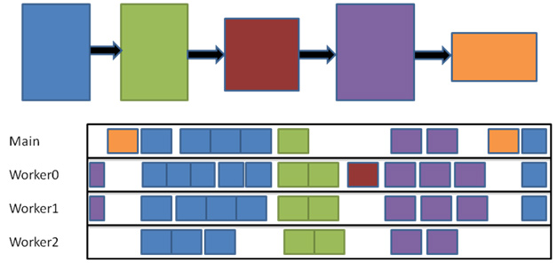
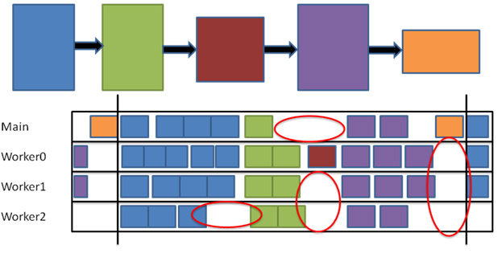
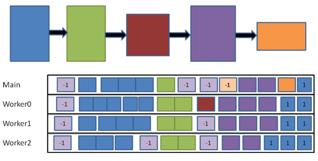

<!--
https://software.intel.com/en-us/articles/using-tasking-to-scale-game-engine-systems
-->

# Using Tasking to Scale Game Engine Systems

**By Yannis Minadakis, published on February 28, 2011**

## Download Article or Visit Game Tasking HomePage

Download [Using Tasking to Scale Game Engine Systems](https://software.intel.com/sites/default/files/Using_Tasking_to_Scale_Game_Engine_Systems.pdf) [PDF 436KB]

View [Game Engine Tasking Animation page (source code, binary, videos)](https://software.intel.com/en-us/articles/game-engine-tasking-animation)

## Introduction

Desktop gaming systems with 6 cores and 12 hardware threads have been on the market for some time now, and 4-core CPUs are becoming increasingly common even on laptops. To give your customers the best experience on their particular platform, we want to write game engine code that is core count independent. Tasking allows allows programs to benefit from scaling as core counts are increased, giving our users a great game experience consistent with their choice of hardware. In this sample, we will convert a single-threaded animation system into a tasking animation system.

## Tasking Terms

- **Task:** A task is an independent unit of work in a system. A task is implemented as a callback function. In this example we are tasking the animation system. Each task animates a model in the scene.
- **Taskset:** The taskset is the scheduling primitive for the application. To schedule work the application creates a taskset, specifying the task function and any dependency information.
- **Dependency graph:** The tasks inside a taskset execute asynchronously. Tasksets execute only when their dependencies have been satisfied.
- **Scheduler:** The scheduler is internal to the Tasking API. The scheduler is responsible for creating and managing all the worker threads and executing the tasks.

The sample uses Intel® Threading Building Blocks as its scheduler.

Figure 1 illustrates a dependency graph of tasksets. Below the dependency graph is a representation of a 4-core system. The scheduler executes each task in the set as soon as all the dependencies have been satisfied.



**Figure 1.** *Visualization of a dependency graph and its execution by the scheduler.*

## Making a Good Task

The task function takes four parameters (see Listing 1):

- `pvInfo`: A pointer to the data that is global to the taskset. This data could be thought of as a constant buffer. The actual data is not owned by the Tasking API, so the application is responsible for making sure that the data is valid while the taskset is executing.
- `iContext`: An index that ranges from zero to the number of threads created by the scheduler. This value allows lock-free access to data that is not thread-safe. The Tasking API guarantees only one executing task can have a particular context ID. The canonical usage for the context ID is the D3D11DeviceContext. The application can setup an array of D3D11DeviceContext objects. A task that is rendering into a command list can use the context ID to select a D3D11DeviceContext object from the array without taking any locks.
- `uTaskId`: The task ID indicates which task is executing in the task function. This index is used to select the work of the task from a list. In the sample, it is used to select the model to animate.
- `uTaskCount`: The task count is the total number of tasks that are scheduled to execute in the taskset. This value can be used to map the task ID to a set of objects to process.

```
Void
AnimateModel(
    VOID*                       pvInfo,
    INT                         iContext,
    UINT                        uTaskId,
    UINT                        uTaskCount );
```

**Listing 1.** *Task function signature*

To make a good task, we want to leverage the architecture of the CPU and allow the scheduler to spread the work to the cores as efficiently as possible. Follow the set of heuristics below for optimal task execution.

- **Task running time should be a fraction of the total taskset time.** This allows the scheduler to optimally partition work across the CPU cores. Scheduling a task takes constant time, so it is important to balance the number of tasks to maximize efficient scaling while minimizing scheduling time. For simplicity, the sample task animates a model, so this heuristic is only achieved when there are 20 or more models in the scene. Using the task ID and task count to vary the amount of data processed per task is the best way to find the right balance.
- **Target the working set of the task to 1/4 of the L2 cache size.** Many CPUs feature Intel® Hyper-Threading Technology, so there will be two worker threads per physical core. Targeting 1/4 of the cache per task should allow for optimal cache use. Using the task ID and task count to vary the amount of data processed per task is the best way to find the right balance.
- **Use the context ID instead of locking and interlocked instructions.** Locking inside a task will block that worker thread severely reducing task execution performance. This includes allocating memory which generally requires locking. Even interlocked operations can cause thrashing in the cache. If the taskset needs locking, consider creating two tasksets (see below)
- **Avoid drain-out time by overlapping frames.** Drain-out occurs when a taskset is about to complete and there are no tasksets in the scheduler that are ready to run. (see below)

## Using Dependencies to Avoid Interlocked Operations

Let us consider the example of computing the average luminance of an image using tasking. The first approach would have each task process a set of scan lines and use interlocked exchange add to track the sum. The task will likely be bound on the time it takes to lock the cache line which contains the sum to increment. A better approach would be to create an array of sums. Each task would use the context ID to add the current sum without an interlocked operation. A second taskset containing one task could then be used to sum the array and compute the final average. The second taskset would depend on the first.

## Avoiding Drain-out

Figure 2 shows drain-out time (circled in red) which results from executing the dependency graph. This time cannot be utilized since there are no tasksets in the scheduler that are ready to run. Assuming the dependency graph represents the work to be done in frame, we can execute two frames on the CPU at once. The drain-out time from the dependency graph of frame n will be filled in the work from frame n -1 (see Figure 3).



**Figure 2.** *Dependency graph executing with drain-out highlighted*



**Figure 3.** *Overlapped dependency graph execution*

## Using Tasking in the Sample

The animation sample defines its task to animate one model (see listing 2). To animate the scene we create a taskset where the number of tasks created are equal to the number of models to animate. The task uses the task ID (uModel) to identify which model from the list to animate in this task. The global data pointer (pvInfo) contains the animation time for this frame.

```
void
AnimateModel(
    VOID*                       pvInfo,
    INT                         iContext,
    UINT                        uModel,
    UINT                        uTaskCount )
{
    D3DXMATRIXA16               mIdentity;
    PerFrameAnimationInfo*      pInfo = (PerFrameAnimationInfo*)pvInfo;

    D3DXMatrixIdentity( &mIdentity );
    
    gModels[ uModel ].Mesh.TransformMesh( 
        &mIdentity, 
        pInfo->dTime + gModels[ uModel ].dTimeOffset );

    for( UINT uMesh = 0; uMesh < gModels[ uModel ].Mesh.GetNumMeshes(); ++uMesh )
    {
        for( UINT uMat = 0; uMat < gModels[ uModel ].Mesh.GetNumInfluences( uMesh ); ++uMat )
        {
            const D3DXMATRIX    *pMat;

            pMat = gModels[ uModel ].Mesh.GetMeshInfluenceMatrix( 
                    uMesh, 
                    uMat );

            D3DXMatrixTranspose(
                &gModels[ uModel ].AnimatedBones[ uMesh ][ uMat ],
                pMat );
        }
    }
}
```

**Listing 2.** *The AnimateModel task*

To execute the animation taskset we create the taskset in the OnFrameMove function with the global data and the number of models currently displayed. In Listing 3, the taskset handle (`ghAnimateSet`) is later used in OnD3D11FrameRender() in WaitForSet to yield execution time from the main thread to process any remaining animation tasks. When WaitForSet returns, the animation taskset has completed and its data is available to the main thread to submit to D3D.

```
OnFrameMove()
{
    ...
    gTaskMgr.CreateTaskSet(
            AnimateModel,
            &gAnimationInfo,
            guModels,
            NULL,
            0,
            "Animate Models",
            &ghAnimateSet );
    ...
}

OnD3D11FrameRender()
{
    ...
    gTaskMgr.WaitForSet( ghAnimateSet );
    ...
}
```

**Listing 3.** *Creating the animation taskset*

Figure 4 illustrates the sample running. Use the model count slider to change the model count. Toggle the "Enable Tasking" button to move from single-threaded to multi-threaded. Note that even when animating one model tasking is faster than executing the animation on the main thread. Toggle "Force CPU Bound" to draw only the first triangle in the model to see the effects of tasking on a heavily CPU bound scenario.


**Figure 4.** *Animation sample executing on ATI Radeon\* HD 5870 graphics*

Figure 5 shows the performance cost of increasing the number of animating models in the sample. The data was gathered on an Intel® Core™i7 processor-based system with ATI Radeon* HD 5870 graphics. Note that as we increase the number of animating objects we scale efficiently without specializing the code to the core count.


**Figure 5.** *Performance data from animation sample. Time is in milliseconds per frame. Lower values mean higher performance.*

## References

1. GDC 2011 presentation on tasking.
2. Intel® Threading Building Blocks http://threadingbuildingblocks.org/
